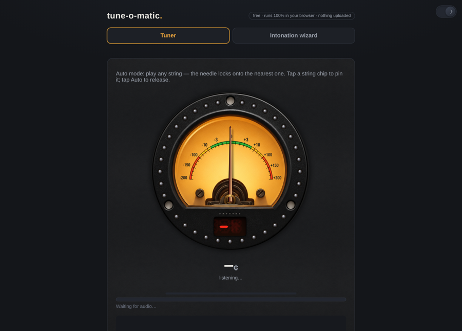
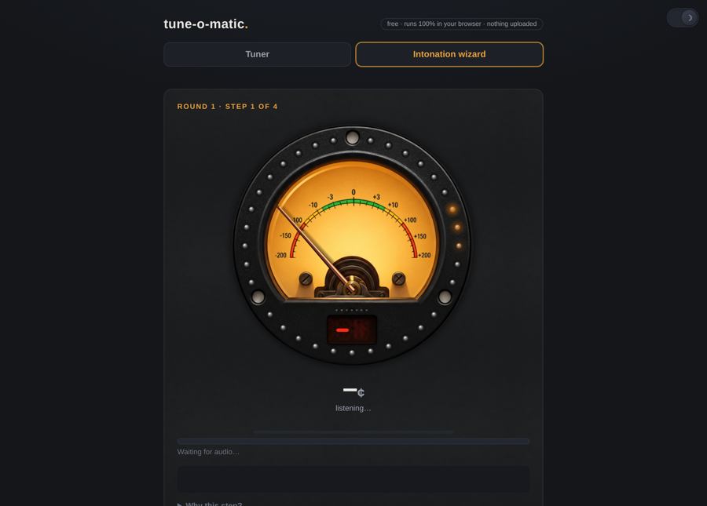

# tune-o-matic

© Kris McCann <kris@8pi.ca> 2026. [Buy me a coffee](https://buymeacoffee.com/ajcrowley)

A free, 100% client-side guitar tuner and intonation wizard that runs entirely
in your browser. It pairs a hand-drawn analog VU meter with precise pitch
detection: the needle and strobe ring behave like real hardware, and a guided
wizard walks you through setting your intonation properly — saddle by saddle —
instead of just telling you a string is flat. No accounts, no uploads, no
tracking: audio never leaves your device.

**Live:** https://intonate.availfind.com/

## Screenshots




## User manual

**Tune a string.** Open the **Tuner** tab, pick your instrument and tuning
from the chips at the top, and pluck. The big needle shows how far off you are
and the strobe ring freezes when you're in tune. That's it — the app handles
the rest.


**Set your intonation.** Open the **Intonation wizard** tab and follow it
string by string: it asks for the open string, then the 12th-fret harmonic,
then the 12th-fret fretted note, and compares the results. If the fretted
note is sharp it tells you to move the saddle back; if flat, forward — with a
rough distance so you're not guessing. Repeat until the step goes green, then
move to the next string.


**Tweaks.** The gear icon opens Advanced Options (sensitivity, tolerances,
theme, LED colour). Everything is optional; the defaults are good.

That's the whole manual. If you want to understand *why* intonation works this
way — or run the full walkthrough with simulated audio before plugging in a
guitar — the tutorial on the landing page covers the long road.

## Configuration (optional)

Tunables live in `assets/gauge-config.json`: sensitivity (input gate + median
filter), tuning tolerances, theme, LED colour, needle feel (`needle_friction`,
`needle_snap`, `needle_kick`), and accidental preference (`auto` shows E♭/B♭
as flats, other accidentals as sharps). Edits take effect on the next page
load. Per-user overrides for tolerances are available in the app's Advanced
Options panel (localStorage).

## Running it

It's a single HTML file plus `assets/`. Any static file server works:

```
python3 -m http.server 8088
```

Open `http://localhost:8088/`. Microphone capture requires a secure context,
so serve over HTTPS (or use localhost) for the tuner to see your input device.

## Privacy

Web Audio runs locally; pitch detection (YIN) happens in your browser. No
telemetry, no analytics, no cookies.

## License

[PolyForm Noncommercial 1.0.0](LICENSE) — free for personal, educational and
noncommercial use; play with it, tweak it, share it. All commercial rights are
reserved by Kris McCann.